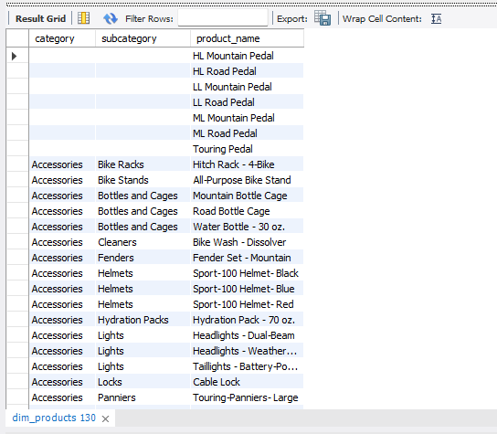

# 📊 SQL Exploratory Data Analysis — Sales Analytics

Exploratory Data Analysis (EDA) on a retail sales data warehouse using pure SQL. The project explores a star-schema dataset (customers, products, sales) to uncover business insights around revenue, customer behavior, product performance, and market reach — the kind of first-pass analysis a data analyst runs before building dashboards or deeper reports.

This project is part of my personal portfolio, built to demonstrate practical SQL and analytical thinking for a **Data Analytics**.

---

## 🎯 Objective

Given raw sales, customer, and product data, answer core business questions such as:

- What is the overall health of the business (total sales, orders, customers)?
- Which products, categories, and countries drive the most revenue?
- Who are the top customers, and how is the customer base distributed?
- How does the business rank its products by performance?

---

## 🗂️ Dataset

The dataset follows a simple **star schema** with one fact table and two dimension tables.

| Table | Description | Rows (approx.) |
|---|---|---|
| `fact_sales` | Transaction-level sales records (orders, quantities, prices, dates) | ~60K |
| `dim_customers` | Customer details (name, country, gender, birthdate, marital status) | ~18K |
| `dim_products` | Product catalog (category, subcategory, cost, product line) | ~295 |

**Key columns used in the analysis:**

- `fact_sales`: `order_number`, `product_key`, `customer_key`, `order_date`, `shipping_date`, `due_date`, `sales_amount`, `quantity`, `price`
- `dim_customers`: `customer_key`, `first_name`, `last_name`, `country`, `gender`, `birthdate`, `marital_status`
- `dim_products`: `product_key`, `product_name`, `category`, `subcategory`, `cost`, `product_line`

Raw CSV files are available in [`/data`](./data).

---

## 🛠️ Tools Used

- **MySQL Workbench** — writing and executing all SQL queries
- **MySQL** — database engine
- **Git & GitHub** — version control

---

## 🧭 Approach

The analysis follows a structured EDA workflow, moving from understanding the raw data to answering business-level questions:

1. **Database Exploration** — inspect tables, check distinct values, understand structure
2. **Dimensions Exploration** — build category/subcategory/product hierarchies
3. **Date Exploration** — find order date ranges and customer age ranges
4. **Measures Exploration** — calculate core KPIs (total sales, quantity, avg price, order/customer/product counts)
5. **Magnitude Analysis** — break down measures by category, country, and gender
6. **Ranking Analysis** — rank products and customers by revenue contribution

All queries are written and commented in [`data analitics EDA.sql`](./data%20analitics%20EDA.sql).

---

## 🔍 Key Analysis & Sample Queries

### 1. Database & Dimensions Exploration
Explored table structures and built a product hierarchy (category → subcategory → product) to understand how the catalog is organized.

```sql
select
  category,
  subcategory,
  product_name
from datawarehouseanalytics.dim_products
order by 1,2,3;
```

<!-- 📸 *Screenshot:* `screenshots/01-product-hierarchy.png` -->

### 2. Date Range Exploration
Identified the sales activity window and the age range of customers.

```sql
select
  min(order_date) as oldest_order,
  max(order_date) as latest_order,
  timestampdiff(year, min(order_date), max(order_date)) as order_range_years
from datawarehouseanalytics.fact_sales
where order_date != '';
```

📸 *Screenshot:* `screenshots/02-date-range.png`

### 3. Business Metrics (KPI Report)
Consolidated the core KPIs — total sales, quantity sold, average price, total orders, products, and customers — into a single summary report using `UNION ALL`.

```sql
select 'Total Sales' as measure_name, sum(sales_amount) as measure_value
from datawarehouseanalytics.fact_sales
union all
select 'Total Quantity', sum(quantity)
from datawarehouseanalytics.fact_sales
union all
select 'Total Orders', count(distinct order_number)
from datawarehouseanalytics.fact_sales;
```

📸 *Screenshot:* `screenshots/03-kpi-report.png`

### 4. Magnitude Analysis — Revenue by Category
Joined `fact_sales` with `dim_products` to find which product categories generate the most revenue.

```sql
select
  p.category,
  sum(f.price) as total_revenue
from datawarehouseanalytics.fact_sales f
left join datawarehouseanalytics.dim_products p
  on f.product_key = p.product_key
group by p.category
order by total_revenue desc;
```

📸 *Screenshot:* `screenshots/04-revenue-by-category.png`

### 5. Customer Distribution by Country & Gender
Analyzed how the customer base is spread across countries and gender segments.

```sql
select
  country,
  count(customer_key) as total_customers
from datawarehouseanalytics.dim_customers
group by country;
```

📸 *Screenshot:* `screenshots/05-customers-by-country.png`

### 6. Ranking — Top Products by Revenue
Used a window function (`DENSE_RANK`) to rank products by total revenue generated.

```sql
select
  p.product_name,
  sum(f.price) as total_revenue,
  dense_rank() over (order by sum(f.price) desc) as ranking
from datawarehouseanalytics.fact_sales f
left join datawarehouseanalytics.dim_products p
  on f.product_key = p.product_key
group by p.product_name
order by total_revenue desc;
```

📸 *Screenshot:* `screenshots/06-top-products-ranked.png`

> 📁 All screenshots are stored in [`/screenshots`](./screenshots). *(Placeholders — to be added.)*

---

## 💡 Insights

*(Fill in with your own takeaways once you review the query outputs — a few examples of the kind of insight to capture:)*

- Identify the top-performing product category and how much of total revenue it represents.
- Identify the top 5 revenue-generating countries/markets.
- Note the size and shape of the customer base (age range, gender split).
- Highlight the top customers and products by revenue contribution.

---

## 🚀 Setup & Reproduction

To run this analysis yourself:

1. **Create the database** in MySQL:
   ```sql
   create database datawarehouseanalytics;
   ```
2. **Import the CSV files** from [`/data`](./data) into matching tables:

   | CSV File | Table Name |
   |---|---|
   | `dim_customers.csv` | `dim_customers` |
   | `dim_products.csv` | `dim_products` |
   | `fact_sales.csv` | `fact_sales` |

   In MySQL Workbench, use **Table Data Import Wizard** (right-click the schema → *Table Data Import Wizard*) for each CSV, letting it infer column types from the header row.
3. **Open [`data analitics EDA.sql`](./data%20analitics%20EDA.sql)** in MySQL Workbench and run the queries section by section, following the comments.

---

## 📁 Project Structure

```
sql-eda-sales-analytics/
├── data/
│   ├── dim_customers.csv
│   ├── dim_products.csv
│   └── fact_sales.csv
├── screenshots/
│   └── (query result screenshots)
├── data analitics EDA.sql
└── README.md
```

---

## 👤 About Me

I'm building a portfolio of hands-on data analytics projects for **Data Analytics** roles. This project reflects my ability to explore a relational dataset with SQL, structure an EDA workflow, and translate raw tables into business-relevant insights.

📧 kavishka.dilshan.cs@gmail.com
